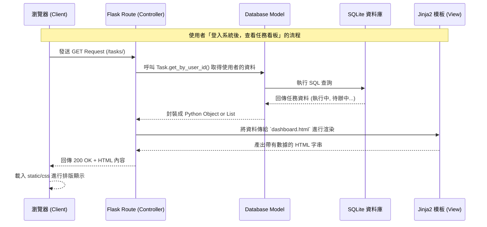

# 系統架構設計文件 (ARCHITECTURE)：任務管理系統

## 1. 技術架構說明

### 選用技術與原因
- **後端框架：Python + Flask**
  - **原因**：Flask 輕量、彈性且學習曲線較平緩。對於此任務管理系統 MVP 來說，不需要過多複雜的配置，Flask 能讓我們快速打造出具備路由與邏輯控制的 Web 應用程式。
- **前端渲染：Jinja2**
  - **原因**：相較於前後端分離架構，傳統伺服器端渲染 (SSR) 在中小型系統中開發速度更快且較無跨越限制。Jinja2 內建於 Flask 生態系中，方便透過迴圈或條件語句動態產生 HTML。
- **資料庫：SQLite (透過 sqlite3 或 SQLAlchemy)**
  - **原因**：設定極簡，不需要額外安裝或維護獨立的資料庫伺服器 (如 MySQL, PostgreSQL)。資料庫檔案存在本地，非常適合用於輕量的個人用或開發中專案。

### Flask MVC 模式說明
雖然 Flask 本身是微定義（Micro-framework），但我們將採用經典的 **MVC (Model-View-Controller)** 模式來組織程式碼：
- **Model (模型)**：負責與 SQLite 資料庫溝通，包含資料表的定義（如 `User`, `Task`）以及資料的 CRUD 語法。
- **View (視圖)**：以 Jinja2 模板 (HTML) 及靜態資源 (CSS, JS) 為主，負責處理畫面的呈現。將從 Controller 接收過來的資料填入網頁中。
- **Controller (控制器)**：由 Flask 的路由 (Routes) 扮演。接收使用者的 Request（如點擊按鈕、提交表單），處理核心商業邏輯（判斷邏輯、呼叫 Model 更新資料庫），然後將結果傳遞給相對應的 View 渲染回傳給瀏覽器。

---

## 2. 專案資料夾結構

本專案建議採取統一且易於擴展的資料夾分類法（Factory 或 Blueprint 結構）：

```text
web_app_development/
├── docs/                   ← 放置專案相關文件
│   ├── PRD.md              ← 專案需求文件
│   └── ARCHITECTURE.md     ← 系統架構設計文件 (本文件)
├── app/                    ← 應用程式的主要目錄
│   ├── __init__.py         ← 建立/初始化 Flask 實例與資料庫的工廠函數所在
│   ├── models/             ← 資料庫模型區塊 (Model)
│   │   ├── __init__.py
│   │   ├── user.py         ← 定義 User 表格與相關操作
│   │   └── task.py         ← 定義 Task 表格與相關操作
│   ├── routes/             ← Flask 路由與邏輯控制 (Controller)
│   │   ├── __init__.py
│   │   ├── auth.py         ← 註冊、登入登出邏輯 (Blueprint)
│   │   └── tasks.py        ← 看板、任務 CRUD 邏輯 (Blueprint)
│   ├── templates/          ← HTML 檔案存放區 (View)
│   │   ├── base.html       ← 共用網頁佈局 (Navbar, Footer, import CSS)
│   │   ├── auth/           ← 登入註冊相關畫面
│   │   │   ├── login.html
│   │   │   └── register.html
│   │   └── tasks/          ← 任務相關畫面
│   │       ├── dashboard.html  ← 主要任務看板 (區分各狀態)
│   │       ├── create.html     ← 新增任務表單
│   │       └── edit.html       ← 編輯任務表單
│   └── static/             ← 靜態資源存放區
│       ├── css/
│       │   └── style.css   ← 客製化樣式
│       └── js/
│           └── main.js     ← 介面的簡單動態效果 (若需要)
├── instance/               ← 運行時產生的檔案存放區
│   └── database.db         ← SQLite 本地資料庫檔案
├── .gitignore              ← 忽略不需要進 Git 的檔案 (如虛擬環境、.db)
├── requirements.txt        ← Python 相依套件清單
└── app.py                  ← 啟動伺服器的入口檔案
```

---

## 3. 元件關係圖

以下展示使用者在瀏覽器操作時，伺服器各個元件間的數據流與互動：



---

## 4. 關鍵設計決策

以下列出本專案在技術實踐與架構上的重要設計與權衡：

1. **認證機制的實作 (Session)**
   - **決策**：在使用者登入驗證上，直接使用 Flask 內建的 `session`（基於跨站安全的 signed cookies）。
   - **原因**：系統不具備前後端分離且不需要開發給外部應用的 API，傳統網站的 Session 認證方式開發迅速且已足夠安全，沒有必要引入複雜的 JWT 或 OAuth。

2. **採用 Blueprints 模組化路由**
   - **決策**：在 `app/routes/` 裡，將認證（`auth.py`）與任務管理（`tasks.py`）這兩條主要路徑透過 Flask Blueprint 分割。
   - **原因**：雖然目前專案小，寫在同一個 `app.py` 中也能運作；但模組化能讓職責更釐清，未來若要擴充其他如「個人檔案設定」功能時，程式碼依然容易維護。

3. **四種任務狀態的管理**
   - **決策**：使用預設字串或 Python Enum 作為任務進度的 Status（例如 `TODO`, `IN_PROGRESS`, `DONE`, `UNCOMPLETED`），儲存在獨立欄位。
   - **原因**：避免為不同狀態建立各自的資料表。這樣可以輕鬆透過一條 SQL 或 ORM 查詢（如 `WHERE status = 'TODO'`），在 Jinja2 的模板裡配合迴圈與條件語句，分別產出「代辦中」、「執行中」等看板區塊。

4. **非同步 (AJAX) 優先級低**
   - **決策**：第一版 (MVP) 新增或修改任務時，優先使用標準 HTML Form POST 到後端，並依賴後端的 `redirect()` 重整網頁。
   - **原因**：專注於先完成伺服器核心端邏輯，等系統穩定，再決定是否要在畫面上導入 AJAX/fetch 以達到不換頁直接更新狀態的效果。這有助於嚴格控制專案收斂時程。
