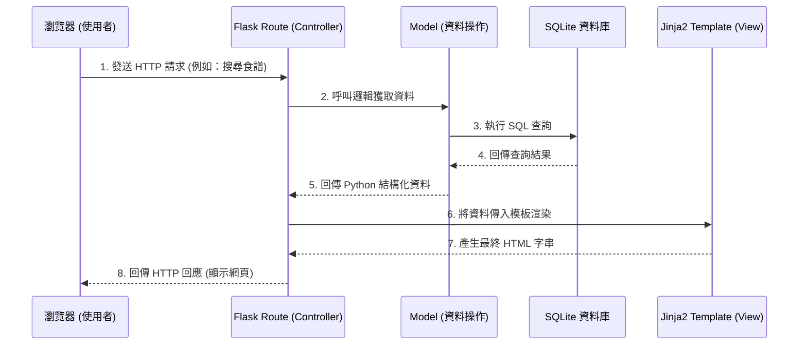

# 系統架構設計文件：食譜管理系統

## 1. 技術架構說明

本專案採用輕量級的 Python 網頁框架設計，不採用前後端分離，由後端直接渲染 HTML 頁面返回給使用者的瀏覽器。

### 選用技術與原因
- **後端框架：Python + Flask**
  - **原因**：Flask 相較於 Django 更為輕量與彈性，非常適合用來開發這類中小型內容管理系統。其學習曲線平緩且易於快速打造原型。
- **模板引擎：Jinja2**
  - **原因**：與 Flask 高度整合，能直接將後端資料無縫嵌入前端 HTML 中，有效降低開發複雜度，並且內建自動轉義防護 XSS 攻擊。
- **資料庫：SQLite**
  - **原因**：不需額外安裝資料庫伺服器，資料儲存在單一檔案中，易於備份與部署，完全符合 MVP (最小可行性產品) 與個人使用的效能需求。

### Flask MVC 模式說明
雖然 Flask 本身不強制要求 MVC 架構，但我們將依循 MVC (Model-View-Controller) 的概念來組織程式碼：
- **Model (模型)**：負責與 SQLite 資料庫溝通，定義「食譜 (Recipe)」、「標籤 (Tag)」等資料結構與操作。
- **View (視圖)**：由 Jinja2 模板擔任，負責產生最終的 HTML 介面，呈現資料給使用者。
- **Controller (控制器)**：由 Flask 的路由 (Routes) 擔任，負責接收使用者請求、調用 Model 獲取或更新資料、接著把資料傳遞給 View 進行渲染。

## 2. 專案資料夾結構

以下是本專案的資料夾結構與各階層職責說明：

```text
web_app_development/
├── app/                  # 應用程式主目錄
│   ├── __init__.py       # 初始化 Flask 應用程式與套件配置
│   ├── models/           # (Model) 資料庫模型定義與操作
│   │   └── recipe.py     # 食譜相關的資料庫邏輯
│   ├── routes/           # (Controller) Flask 路由處理邏輯
│   │   ├── __init__.py
│   │   └── recipe.py     # 處理食譜的增刪改查與搜尋推薦路由
│   ├── templates/        # (View) Jinja2 HTML 頁面模板
│   │   ├── base.html     # 共用版型 (標題、導覽列)
│   │   └── recipes/      # 食譜相關頁面
│   │       ├── index.html   # 食譜列表/首頁
│   │       ├── show.html    # 食譜明細頁面
│   │       └── form.html    # 新增與編輯表單
│   └── static/           # css, js, 圖片等靜態資源
│       ├── css/
│       │   └── style.css
│       └── images/       # 存放使用者預設圖片等
├── instance/             # 存放敏感或變動性的本地端資料
│   └── database.db       # SQLite 資料庫檔案
├── docs/                 # 專案文件
│   ├── PRD.md            # 產品需求文件
│   └── ARCHITECTURE.md   # 系統架構文件
├── requirements.txt      # Python 依賴套件清單
└── app.py                # 應用程式啟動入口
```

## 3. 元件關係圖

以下展示使用者與系統互動時，各元件如何協作產生回應：



## 4. 關鍵設計決策

1. **採用 SSR (伺服器端渲染) 而非 SPA (單頁應用)**
   - 作為初期 MVP 專案，使用 Flask + Jinja2 直接渲染頁面是最快看到成果的方式，避免了繁瑣的 API 介接與跨域問題，能讓重點集中於食譜核心邏輯。
2. **採用 SQLite 單一檔案資料庫**
   - 避免引入如 MySQL 或 PostgreSQL 帶來額外的效能與維護成本，SQLite 非常輕量且零設定，對於主要是單人使用的儲存與搜尋已綽綽有餘。
3. **Model 與 Controller 邏輯分離**
   - 雖然初期專案較小，但不把所有的資料庫存取層直接寫在 `app.py` 或具體的 route 中。將資料庫層抽象出 `app/models/`，能確保留下擴展「食譜標籤系統」與「食材推薦演算法」的彈性空間。
4. **使用模板繼承機制 (共用 Base)**
   - 透過 `base.html` 共用 Header、導覽列及自訂的 CSS 資源。日後不論是新增編輯頁面還是推薦食譜頁面，只需專注頁面本體，可達到最好的維護性並維持設計的一致感。
