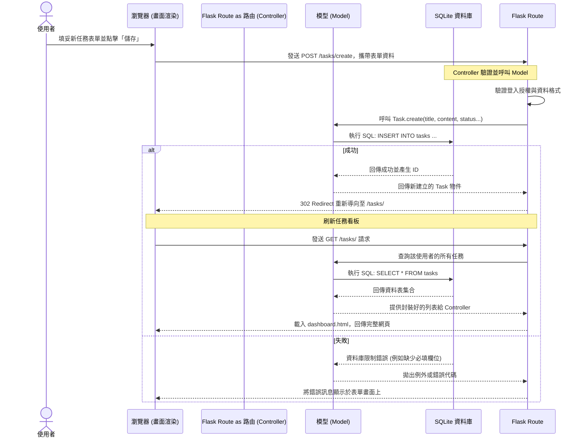

# 系統流程圖文件 (FLOWCHART)：任務管理系統

依據 [PRD文件](PRD.md) 與 [架構設計文件](ARCHITECTURE.md)，本文件定義了「任務管理系統」的使用者操作行為路徑與系統內部互動流程。

---

## 1. 使用者流程圖 (User Flow)

此流程圖從使用者打開網頁開始，涵蓋了註冊/登入以及對於任務板塊上的各種操作路徑（包含新增、狀態切換、編輯與刪除任務）。

```mermaid
flowchart TD
    A([使用者進入首頁]) --> B{是否已登入?}
    
    B -- 否 --> C[前往登入/註冊頁面]
    C -->|成功註冊或登入| D
    
    B -- 是 --> D[主要任務看板 (Dashboard)]
    
    D --> E{選擇要執行的操作}
    
    %% 新增路線
    E -->|新增任務| F[填寫任務名稱與詳細內容]
    F -->|送出表單| G[(後端儲存新任務)]
    G --> D
    
    %% 狀態切換路線
    E -->|切換任務狀態| H[點擊「執行中/完成」等按鈕]
    H --> I[(後端更新狀態)]
    I --> D
    
    %% 編輯路線
    E -->|編輯任務| J[進入該任務的修改表單]
    J -->|送出更新| K[(後端儲存變更)]
    K --> D
    
    %% 刪除路線
    E -->|刪除任務| L{彈出確認警告}
    L -- 是 --> M[(後端刪除任務)]
    M --> D
    L -- 否 --> D
    
    %% 登出
    E -->|登出| N[登出系統]
    N --> C
```

---

## 2. 系統序列圖 (Sequence Diagram)

此序列圖描述「使用者點選新增任務並送出」的完整運作流程。這展示了瀏覽器、Flask Controller、Model 以及 SQLite 之間的資料傳遞過程。



---

## 3. 功能清單對照表 (Route Mapping)

依據系統架構，以下總結出使用者操作與後端接收的端點 (Endpoint) 及 HTTP 方法關聯：

| 模組 | 功能說明 | 預期 URL 路徑 | HTTP 方法 | 對應 View (Jinja2) 或行為 |
|---|---|---|:---:|---|
| **認證** | 註冊新帳號 | `/register` | GET / POST | `register.html` 或 建立資料並登出/登入 |
| **認證** | 登入頁面 | `/login` | GET / POST | `login.html` 或 建立 Session |
| **認證** | 登出 | `/logout` | GET/POST | 清除 Session，導回 `/login` |
| **任務** | 任務看板 (主畫面) | `/tasks/` (或 `/`) | GET | `dashboard.html` (依狀態分類呈現) |
| **任務** | 新增任務表單 | `/tasks/create` | GET / POST | `create.html` (GET) / 寫入 DB 並重導向 (POST) |
| **任務** | 編輯任務表單 | `/tasks/<id>/edit` | GET / POST | `edit.html` (GET) / 更新 DB 並重導向 (POST) |
| **任務** | 切換任務狀態 | `/tasks/<id>/status` | POST | 直接更新 DB，不需畫面，完成後重導向回看板 |
| **任務** | 刪除任務 | `/tasks/<id>/delete` | POST | 直接刪除 DB，不需畫面，完成後重導向回看板 |
